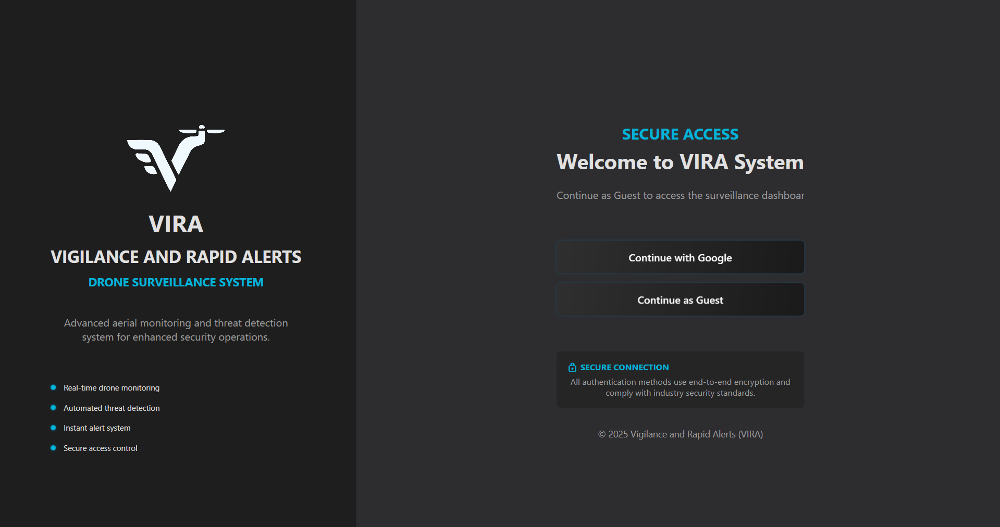
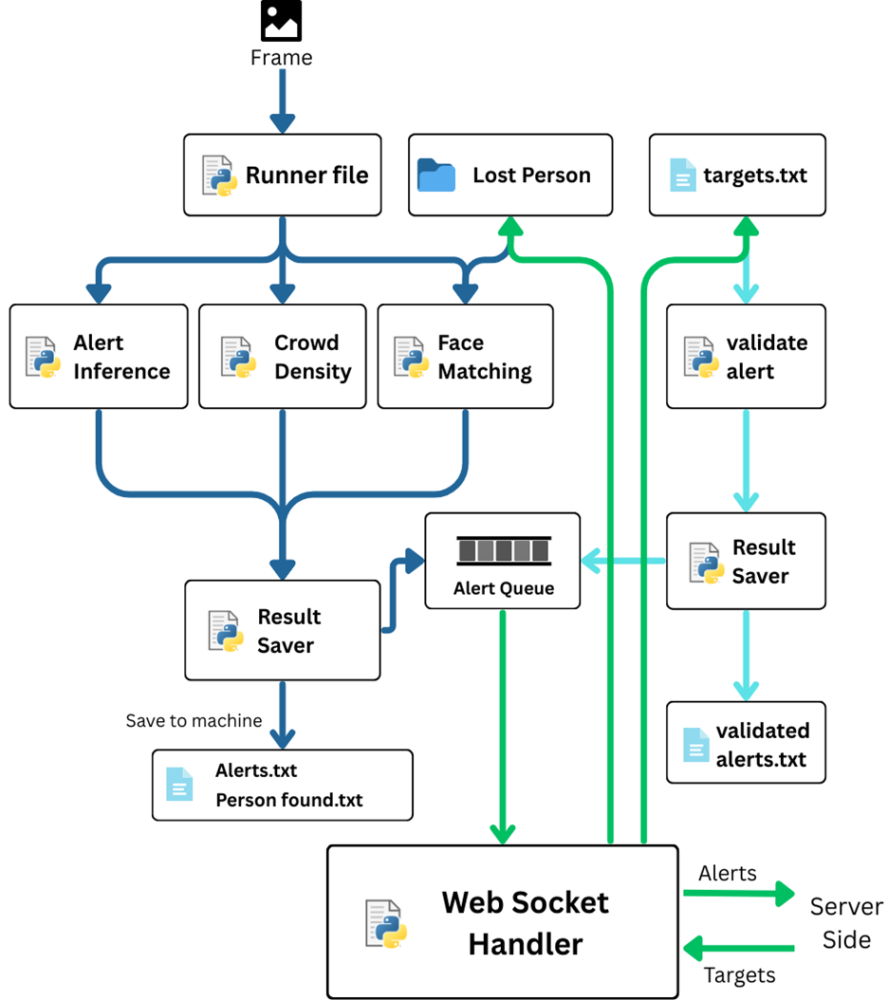

# Vigilance And Rapid Alerts (VIRA)

This is an AI powered survillance system which used **Drone** and **CCTV** Networks to detect emergencies, alerts and suspecious activities in real time, displaying them on **dedicated interface** and processing for optimal safe space where **drone can hover to validate alert & rapid response in absence of authority**.

The **Drone Surveillance System** is an enterprise-grade surveillance platform designed to provide real-time monitoring and intelligent threat detection across large geographical areas using autonomous drones and fixed CCTV infrastructure. Built with modern cloud-native technologies, it combines:

- **Real-time GPS tracking** of multiple drones simultaneously
- **AI-powered threat detection** including facial recognition, crowd analysis, and anomaly detection
- **Multi-modal surveillance** (Drones + CCTV cameras)
- **Scalable infrastructure** deployed on cloud platforms (Render)
- **Advanced networking** capabilities for managing surveillance zones by region

### Why VIRA?

| Feature | Description |
|---------|-------------|
|**Real-time Processing** | Live video feeds from drones and cameras with sub-second latency |
|**AI Detection Models** | YOLOv11 for object detection, FaceNet for recognition, MiDaS for depth estimation |
|**Crowd Analytics** | Real-time crowd density analysis and behavior prediction |
|**GPS Tracking** | Precise drone positioning with historical path analysis |
|**Smart Alerts** | Intelligent alert system with priority levels and automatic escalation |
|**Security-First Design** | GOOGLE ID authentication, encrypted communications, audit trails |
|**Scalability** | Handles multiple drones, cameras, and simultaneous users |
---

---

## Know About VIRA
- [Modules In VIRA](#core-components)
  - [Drone Client / CCTV Client](#client)
  - [Application](#application)
  - [Communication Server](#communication-server)
  - [Simulation Engine](#simulation-engine)
- [Pipeline Of VIRA](#complete-pipeline)
- [Use Cases and Impact](#use-cases-and-impact)
- [Quick Start Guide](#quick-start-guide)

## Modules In VIRA


### Drone Client / CCTV Client
The **Drone Client** captures real-time video and telemetry data, which is processed through the Python inference pipeline for threat detection (e.g., alerts, face recognition, crowd analysis). It communicates with the system via WebSocket, sending processed alerts and receiving control commands from the control services.

The **CCTV Client** streams surveillance footage to the backend, where AI models analyze it for events like crowd density and suspicious activity. Similar to drones, it integrates through WebSocket communication, enabling real-time alert generation and monitoring within the system dashboard.



### Application
- Built with FastAPI and uses Uvicorn as the ASGI server for high-performance async request handling
- Real-time bidirectional communication between drones and applications via WebSocket connections at `/ws/drone/{drone_id}` and `/ws/application/{app_id}`
- Firebase Realtime Database authentication to verify client IDs before establishing WebSocket connections, checking against `app_clients` and `drone_clients` registries
- Fail-open authentication strategy — if Firebase is unavailable or encounters errors, connections are still allowed to prevent outages
- MongoDB (via Motor async driver) for persistent storage of alerts and alert images, with automatic schema creation and index management on startup
- MongoDB Change Streams to watch for real-time alert inserts/updates and automatically broadcast changes to all connected application clients
- Alert lifecycle management with statuses: `Pending` → `In Validation` → `Validated`/`Rejected`/`Responded`, driven by drone and application interactions
- Drones can submit alerts with location coordinates, confidence scores, timestamps, and images; these are persisted and broadcast to all connected applications
- Applications can send target position commands to specific drones, which also updates the corresponding alert status to "In Validation" in the database
- Drones can send validated alert responses back, which update the alert status based on `rl_responsed` and `image_received` flags (Validated, Rejected, or Responded)
- Alert image handling with deduplication — incoming images with a matching `name` field update the existing record rather than creating a duplicate
- Alert images from drones are broadcast to all applications and all other connected drones (excluding the sender)
- Alert images from applications are broadcast to all connected drones
- Drone position updates (`drone_pos`) are forwarded from drones to all connected applications in real time
- Full REST API for CRUD operations on alerts (`/api/alerts`) and alert images (`/api/alert-images`)
- Local client registry system that tracks drone and application connection history, capabilities, authorization status, and metadata, persisted to a JSON file
- REST endpoints for client management: list all clients, filter by type, view online clients, authorize/deauthorize, and remove clients
- CLI tool (`manage_clients.py`) for offline client registry management — list, add, remove, update, authorize, export, and import clients
- WebSocket ping/pong keep-alive mechanism for connection health monitoring
- Dashboard served as static files at `/dashboard/`
- Health check endpoint at `/health` returning database connection status and WebSocket connection statistics
- Debug endpoint at `/debug/env` for troubleshooting environment variable configuration
- CORS middleware configured to allow all origins (development mode)
- Environment-based configuration via `.env` file with support for MongoDB URI, Firebase credentials, host, port, debug mode, and secret keys
- Deployment-ready with `Procfile` (Heroku/Railway), `render.yaml` (Render), and `railway.json` configuration files
- Automatic datetime and BSON ObjectId serialization for JSON-safe WebSocket message delivery
- File upload support with configurable directory and 10MB max file size
- JWT-compatible security configuration with secret key, HS256 algorithm, and 30-minute token expiry (infrastructure in place)

## Communication Server
- The Vira Communication Server is the central nervous system of the Vira Drone Surveillance platform — it exists to enable real-time, low-latency communication between surveillance drones operating in the field and the monitoring applications used by operators
- Without this server, drones and applications would have no way to exchange live data; each drone would operate in isolation with no way to relay alerts, images, or positions to the people who need to act on them
- It bridges the gap between hardware (drones) and software (monitoring apps) by acting as a persistent message broker — drones connect once and continuously stream data, while applications receive that data instantly without polling
- It ensures that multiple applications can monitor the same set of drones simultaneously, and any application can issue commands to any connected drone, enabling collaborative and distributed surveillance operations
- It provides data persistence through MongoDB so that alerts and images are never lost, even if an application disconnects and reconnects later — new applications receive the latest 50 alerts immediately upon connection
- It handles authentication via Firebase Realtime Database to ensure only registered and authorized drones and applications can participate in the communication network, preventing unauthorized access to the surveillance system
- The server uses MongoDB Change Streams to guarantee that all connected applications stay in sync — any database-level change is automatically pushed out in real time

- **Message types the server handles:**

  - **`alert`** — Sent by drones when a surveillance event is detected (e.g., "Casualty - Person Detected"). Contains the alert description, drone ID, GPS coordinates (x, y, z), confidence score, timestamp, and optional image data. The server persists it to MongoDB and broadcasts it to all connected applications.

  - **`alert_image`** — Sent by both drones and applications. When a drone sends it, the image data (including detection status, name, actual image blob, matched frame blob, and location) is stored in MongoDB and broadcast to all applications and all other drones. When an application sends it, the image is stored and broadcast to all drones. This enables bi-directional image sharing for verification workflows.

  - **`drone_pos`** — Sent by drones to report their current position. The server forwards this to all connected applications in real time, enabling live drone tracking on monitoring dashboards and maps.

  - **`target_pos`** — Sent by applications to command a specific drone to navigate to a target location. The server routes this to the specified drone and updates the corresponding alert status to "In Validation" in the database, marking that an operator has responded.

  - **`validated_alert`** — Sent by drones after they have visited a target location and validated (or rejected) an alert. Contains `rl_responsed` and `image_received` flags that determine the final alert status — "Validated" (confirmed with image), "Rejected" (confirmed as false positive), or "Responded" (acknowledged without full validation). The server updates the database and broadcasts the result to all applications.

  - **`ping` / `pong`** — Keep-alive messages. Any client can send a `ping`, and the server responds with a `pong` to confirm the connection is still active.

  - **`connection_established`** — Sent by the server to a client immediately after a successful WebSocket handshake, confirming the client ID, client type, and Firebase authentication bucket.

  - **`initial_alerts`** — Sent by the server to newly connected applications, containing the most recent 50 alerts from the database so the app has immediate operational context.

  - **`alert_update`** — Sent by the server to all connected applications whenever a MongoDB Change Stream detects an insert, update, or replace operation on the alerts collection, keeping every app in real-time sync with the database.

## Simulation

**Images Of Simulation**

- The Vira Drone Surveillance System uses a physics-based simulation engine built with **PyBullet** and **gym-pybullet-drones** to simulate drone flight dynamics, and integrates with **Unreal Engine-quality 3D environment assets** for high-fidelity visual scene rendering
- The simulation exists so that the entire surveillance pipeline — drone flight, AI inference, alert generation, and server communication — can be developed, tested, and trained without requiring real drone hardware or risking physical equipment
- It provides a safe, repeatable environment for training Reinforcement Learning (RL) models that control drone behavior such as takeoff, hovering, navigation, and emergency recovery

- **Environment & Scene Setup:**
  - The simulation constructs a rich 3D world using OBJ mesh assets loaded into PyBullet, providing realistic visual and physical properties
  - Environment assets include: terrain mesh, grass land, buildings, boundary walls (4 sides), car accident scene, accidental fire scene, flood scene, riot scene, person with knife, and person with mask
  - Each asset is placed at specific 3D coordinates with proper orientation and scale, creating a realistic surveillance scenario with multiple threat types scattered across the environment
  - Objects have collision shapes for physical interaction with the drone, preventing fly-through and enabling realistic navigation constraints

- **Drone Physics & Control:**
  - Uses the Crazyflie 2.X (CF2X) drone model with realistic quadrotor dynamics including rotor RPM control, wind effects, and collision detection
  - PID control (DSLPIDControl) translates high-level position and yaw targets into low-level rotor RPM commands for stable flight
  - Supports multiple control modes: `position_only` (3-axis), `position_yaw` (3-axis + heading), and `full_attitude` (6-DOF)
  - Flight boundaries are enforced at ±80m on X/Y axes and 1.5m–80m on the Z axis to keep the drone within the simulation area
  - Smooth target-following with configurable max speed (4.0 m/s), position tolerance (0.5m), and movement smoothing factor

- **Reinforcement Learning Integration:**
  - Uses Stable Baselines3 PPO (Proximal Policy Optimization) models stored as `.zip` files for learned drone control policies
  - The current trained model (`ppo_emergency_takeoff_recovery_working_position_yaw_interrupted.zip`) handles emergency takeoff and recovery with position and yaw control
  - A reward function guides training: penalizes low altitude and crashes, rewards maintaining proper flight height (1.5m–6m), rewards approaching targets, and gives bonuses for reaching target positions
  - The `train_hover_spin3.py` script provides the training pipeline for creating new RL policies

- **Drone Camera & AI Inference:**
  - A virtual camera is mounted on the simulated drone with a 90° field of view, capturing 224×224 RGB images at the drone's position and orientation
  - Camera intrinsic and extrinsic matrices are computed for each frame, enabling proper 3D coordinate mapping from pixel space to world space
  - Captured frames are fed directly into the same AI inference pipeline (`runner.runner_sim`) used by real drones — running YOLOv11 object detection, FaceNet face recognition, and crowd density analysis on the simulated camera feed
  - This means the AI models are tested against the simulated environment assets (fire, riots, person with knife, etc.) exactly as they would process real drone footage

- **Waypoint Navigation & Alert Validation:**
  - The simulation reads target coordinates from a `drone_targets.txt` file, each entry containing a target ID, 3D location, yaw angle, alert name, and alert ID
  - The drone autonomously navigates to each waypoint using smooth position control, waits until it reaches the target, then captures a frame and runs `validate_alert()` to validate the alert
  - This simulates the real-world flow where the Vira desktop application sends a `target_pos` command, the drone navigates there, captures evidence, and sends back a `validated_alert`
  - A continuous monitoring thread watches the targets file for new coordinates, allowing real-time waypoint injection during simulation

- **Flight Patterns & Maneuvers:**
  - Supports continuous spinning (clockwise/counterclockwise) at configurable angular velocity
  - Predefined spin patterns: figure-8, circle, square (90° turns), and random rotation
  - Rotate-to-angle commands for precise heading control
  - Hover-in-place mode when no target is active

- **Connection to Vira Communication Server:**
  - The simulation's inference engine generates alerts in the same format as real drone hardware
  - These alerts flow through the WebSocket handler to the Vira Communication Server, making the simulation indistinguishable from a real drone in the overall system architecture
  - Operators using the desktop application can monitor simulated drone activity, receive alerts, and send commands back — testing the full end-to-end pipeline without any physical drone


# Pipeline Of VIRA



- A **Frame** (image captured from the drone's camera or simulation) enters the pipeline as the starting input

- The **Runner File** (`runner.py`) receives the frame and acts as the central orchestrator — it distributes the frame to three parallel AI inference threads:
  - **Alert Inference** — runs YOLOv11 object detection to identify threats such as weapons, suspicious persons, fires, accidents, and anomalies, producing alerts with confidence scores
  - **Crowd Density** — analyzes the frame for crowd concentration levels and behavioral patterns, estimating density metrics
  - **Face Matching** — compares detected faces against the **Lost Person** database (a folder of reference images), identifying missing or wanted individuals using FaceNet embeddings

- All three inference modules feed their results into the **Result Saver**, which persists the detection outputs locally on the drone's machine:
  - `Alerts.txt` — stores detected threat alerts with confidence scores and metadata
  - `Person found.txt` — stores identified lost person matches with match confidence

- Simultaneously, the inference results are pushed into the **Alert Queue**, a buffer that stages alerts for transmission to the server

- The **WebSocket Handler** (`websocket_handler.py`) reads from the Alert Queue and sends **Alerts** outbound to the **Server Side** (Vira Communication Server) over a persistent WebSocket connection

- On the return path (cyan/light blue flow), the server sends back **Targets** — these are `target_pos` commands from the monitoring application, instructing the drone to navigate to a specific location to verify an alert

- Target coordinates are written to **`targets.txt`** (`drone_targets.txt`), which the simulation or drone controller continuously monitors for new waypoints

- When the drone reaches a target location, the **Validate Alert** module captures a new frame at that position and runs inference to confirm or deny the original alert

- The validation result flows into a **Result Saver** which writes to **`validated alerts.txt`**, recording whether the alert was confirmed (validated) or rejected (false positive)

- The validated result is also fed back into the **Alert Queue**, which the **WebSocket Handler** picks up and sends back to the **Server Side** as a `validated_alert` message — closing the full detection-validation loop

- **Summary of the two directional flows:**
  - **Dark blue flow (outbound):** Frame → Runner → AI Inference (3 threads) → Result Saver → Alert Queue → WebSocket Handler → Server
  - **Cyan/green flow (inbound):** Server → WebSocket Handler → targets.txt → Validate Alert → Result Saver → validated alerts.txt → Alert Queue → WebSocket Handler → Server


# Use Cases and Impact
- **Border Patrol & Perimeter Protection** — Monitor international boundaries and restricted zones with real-time detection of unauthorized crossings or intrusions, enabling autonomous threat detection that reduces human error and response time from minutes to seconds

- **Event Security & Crowd Monitoring** — Provide aerial surveillance at large gatherings such as concerts, protests, and sports events with real-time crowd density analysis, behavior prediction, and automatic detection of prohibited items like weapons

- **Criminal Investigation & Lost Person Finding** — Use FaceNet-based facial recognition to match detected faces against a database of missing or wanted individuals, enabling rapid identification in crowded or hard-to-reach areas

- **Disaster Assessment & Search and Rescue** — Rapidly evaluate damage from fires, floods, or earthquakes with autonomous aerial surveys, automatically detect casualties using crowd analysis, and provide real-time situational awareness to command centers so first responders reach targets 30% faster

- **Evacuation Monitoring** — Verify complete area clearance before hazardous operations by continuously scanning evacuation zones with AI-powered person detection

- **Traffic Flow Monitoring & Accident Response** — Detect congestion in real time for routing optimization, automatically identify and document traffic accidents with sub-30-second incident-to-alert latency, and track 50,000+ vehicles daily per city

- **Parking & Traffic Violation Enforcement** — Autonomously detect parking violations, speeding, red light violations, and improper lane usage, reducing traffic enforcement costs by 50%

# Quick Start Guide
```
- **Prerequisites:**
  - Python 3.8+ installed
  - .NET 8 SDK installed (for the desktop application)
  - GPU recommended for real-time AI inference (CPU works but slower)
  - A webcam or camera connected to the machine (for live testing)
  - MongoDB connection string and Firebase project credentials

- **Setting Up the Communication Server:**
  - Navigate to the server directory: `cd Vira-Communication-Server/`
  - Install Python dependencies: `pip install -r requirements.txt`
  - Create a `.env` file with your credentials:
    - `MONGODB_URI` — your MongoDB Atlas connection string
    - `FIREBASE_API` — your Firebase API key
    - `FIREBASE_AUTH_DOMAIN` — your Firebase auth domain
    - `FIREBASE_DATABASE_URL` — your Firebase Realtime Database URL
    - `FIREBASE_PROJECT_ID` — your Firebase project ID
    - `FIREBASE_STORAGE_BUCKET` — your Firebase storage bucket
    - `FIREBASE_MESSAGING_SENDER_ID` — your Firebase messaging sender ID
    - `FIREBASE_APP_ID` — your Firebase app ID
  - Start the server locally: `uvicorn main:app --reload --host 0.0.0.0 --port 8000`
  - Verify it's running by visiting `http://localhost:8000/health` in your browser
  - The server is also deployed on Render at `https://vira-communication-server.onrender.com`

- **Setting Up the Drone Client (Inference Engine):**
  - Navigate to the drone client: `cd drone_client/inference_engine/`
  - Create and activate a virtual environment:
    - Windows: `python -m venv venv` → `source venv/Scripts/activate`
    - macOS/Linux: `python -m venv venv` → `source venv/bin/activate`
  - Install dependencies: `pip install -r requirements.txt`
  - Configure `drone_info.json` with your drone ID and coordinates
  - To connect to the server, edit `websocket_handler.py` and set `SERVER_URL` to your server URL (local or Render)
  - Start live camera testing: `python runner.py`
  - To send alerts to the server: `python runner.py --send-to-server`

- **Running the Desktop Application:*  *
  - Navigate to the application directory: `cd Application/`
  - Build the project: `dotnet build`
  - Run the application: `dotnet run`
  - Or open `DroneSurveillanceSystem.sln` in Visual Studio and run from there
  - Login with your Azure AD credentials or use Guest Mode

- **Running the Simulation (No Physical Drone Needed):**
  - Navigate to the simulation directory: `cd simulation/pybullet_simulation/`
  - Ensure `gym-pybullet-drones`, `stable-baselines3`, and `pybullet` are installed
  - Verify all environment assets exist in the `environment_assets/` folder (mesh, buildings, fire, flood, riot, etc.)
  - Run the simulation: `python drone_simulation.py`
  - The simulation will load the RL model, set up the 3D environment, and begin autonomous flight
  - Add target waypoints to `drone_client/capture_engine/drone_targets.txt` in the format: `{"target_id": 1, "location": [x, y, z, yaw], "alert_name": "...", "alert_id": "..."}`
  - The drone will navigate to each waypoint, capture frames, run AI inference, and validate alerts automatically

- **Keyboard Controls During Live Testing:**
  - `q` — Quit the program
  - `s` — Save the current frame
  - `c` — Clear the alerts file
  - `p` — Pause/resume inference

- **Verifying the Full Pipeline:**
  - Start the Communication Server (locally or use the Render deployment)
  - Start the Drone Client or Simulation with `--send-to-server` enabled
  - Launch the Desktop Application and connect to the server
  - The application dashboard should show real-time drone positions, incoming alerts, and allow you to send target commands back to the drone
  - Alerts flow: Drone → Server → Application
  - Commands flow: Application → Server → Drone

- **Troubleshooting:**
  - Camera not detected → change `CAMERA_ID` to 0, 1, or 2 in `runner.py`, or use an external USB camera
  - Slow processing → GPU is required for real-time performance; reduce resolution or FPS if on CPU
  - Models not loading → verify internet connectivity as models download on first run
  - Out of memory → reduce `QUEUE_SIZE` or close other applications
  - Server not connecting → check that `MONGODB_URI` is valid by visiting `/debug/env` on the server
  - WebSocket rejected → ensure your client ID is registered in Firebase under `clients/app_clients` or `clients/drone_clients`
```
